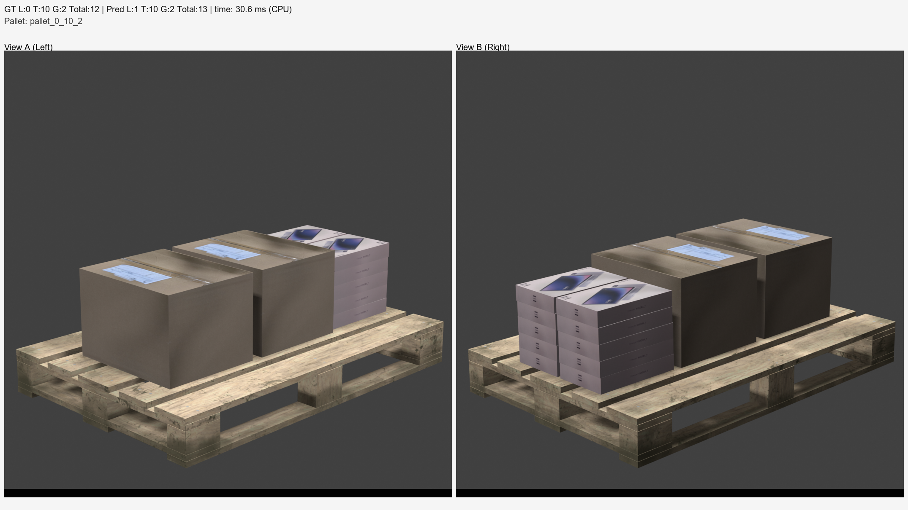
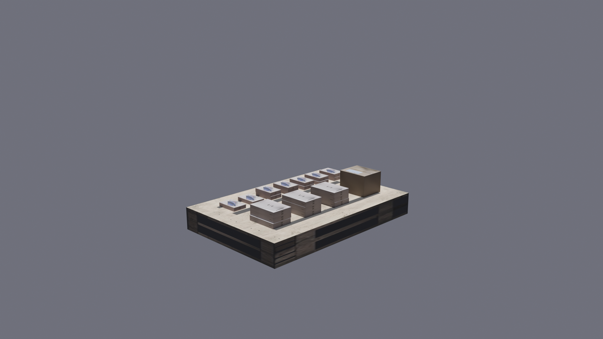

# Box Counter

**Важно:** Веса обученной модели и датасет с синтетическими данными хранятся на диске по ссылке: [ДИСК box_counter](https://drive.google.com/drive/folders/1MP9I_pDscGyoZnAGnygGrl6gGwl416tW?usp=sharing)


Предсказан 1 ноутбук, 10 планшетов и 2 большие коробки 
На самом деле 0 ноутбуков, 10 планшетов и 2 большие коробки 

## Описание проекта

Система автоматического подсчета коробок (ноутбуков, планшетов, групповых упаковок) на паллетах с использованием компьютерного зрения. Проект основан на нейронной сети с dual-view архитектурой для анализа изображений с двух ракурсов.

## Архитектура решения

### Общая схема
Система использует dual-view подход для повышения точности:
- **Входные данные**: Пара изображений паллета с разных ракурсов (левый/правый)
- **Предобработка**: Кропирование ROI области (вырез по центру 1060x1060), ресайз до 224x224
- **Backbone**: EfficientNet-B0 для извлечения признаков из каждого изображения
- **Attention механизм**: CrossViewAttention для объединения информации с двух ракурсов
- **Регрессионная голова**: Multi-layer perceptron с тремя выходами (ноутбуки, планшеты, групповые упаковки)

### Детали архитектуры модели
```
AdvancedBoxCounter:
├── backbone1 (EfficientNet-B0)
├── backbone2 (EfficientNet-B0) 
├── attention (CrossViewAttention)
└── regressor (MLP: 1280 → 1024 → 512 → 256 → 3)
```

### Loss функции
Комбинированная функция потерь включает:
- MSE Loss (основная)
- L1 Loss (регуляризация)
- Focal Regression Loss (фокус на сложных примерах)

## Генерация синтетических данных в Blender

Для создания обучающего датасета использовался Blender со следующим пайплайном:

### Процесс генерации:
Быстрый запуск в Blender в режиме Scripting:
```
# generator.py
class PalletBoxGenerator:
            self.generate_single_scene(laptop_count, tablet_count, group_box_count, output_name)
            ...
if __name__ == "__main__":
    generator = PalletBoxGenerator()

    print("Генерация датасета...")
    generator.generate_dataset(100)
```
Пример синтетических данных


## Проведенные эксперименты

### 1. Backbone архитектуры
- **ResNet-50**: Базовая архитектура
- **EfficientNet-B0**: Лучший баланс точность/скорость (выбранная)

### 2. Механизмы внимания
- **Без attention**: Простое конкатенирование признаков
- **CrossViewAttention**: Взвешенное объединение признаков (выбранное)

### 3. Порядок загрузки изображений  
- **Случайный порядок**: Нестабильные результаты
- **Детекция "left/right"**: Консистентный порядок (выбранный)

### 4. Разрешение изображений
- **128x128**: Пропадает различимость у коробок
- **224x224**: Оптимальный баланс (выбранное)
- **448x448**: Падение точности при росте времени

## Структура проекта

```
box_counter/
├── images/                     # Входные изображения для инференса
├── models/                     # Сохраненные веса модели
├── results/                    # Результаты inference (result.csv)
├── unified_dataset/            # Обработанный датасет
│   ├── train/
│   ├── val/
│   └── test/
├── process_dataset.py          # Обработка и подготовка данных
├── train_advanced.py           # Обучение модели
├── inference.py                # Инференс на новых данных
├── test_vis.py                 # Визуализация результатов
├── requirements.txt            # Python зависимости
├── Dockerfile                  # Docker конфигурация
├── docker-compose.yml          # Docker Compose setup
└── README.md                   # Данный файл
```

## Описание скриптов

### process_dataset.py
**Назначение**: Подготовка и аугментация датасета
Необходимо скачать с диска или сгенерировать самостоятельно дополнительные данные и указать пути к ним
```
# process_dataset.py
CROP_BOX = (407, 40, 407 + 1060, 40 + 1060)
RANDOM_SEED = 42
IMG_SIZE = (224, 224)
AUG_MULTIPLIER = 2


folders = {
    'original': 'images', # <-- Опорные изображения
    'generated': 'box_dataset' # <-- Дополнительные изображения
}

unified_dir = 'unified_dataset' # <-- Итоговый датасет
```

**Основные функции**:
- Кропирование изображений в ROI область
- Ресайз до 224x224 пикселей
- Парсинг меток из имен папок (формат: `pallet_L_T_G`)
- Разделение на train/val/test (80%/10%/10%)
- Аугментация данных (brightness, contrast, rotation, perspective)

**Запуск**:
```bash
python process_dataset.py
```

### train_advanced.py
**Назначение**: Обучение нейронной сети

**Основные компоненты**:
- Dual-view архитектура с EfficientNet backbones
- Cross-view attention механизм
- Комбинированная loss функция
- Early stopping с терпением 15 эпох
- Cosine annealing learning rate scheduler

**Запуск**:
```bash
python train_advanced.py
```

**Результат**: Сохраненная модель в `models/best_model_advanced.pth`

### inference.py  
**Назначение**: Инференс на новых данных

**Функции**:
- Загрузка обученной модели
- Обработка изображений из папки `images/`
- Автоматическое определение пар изображений (left/right)
- Экспорт результатов в `results/result.csv`
- Поддержка ONNX формата для ускорения

**Запуск**:
```bash
python inference.py
```

**Переменные окружения**:
- `USE_ONNX=1`: Использовать ONNX модель
- `EXPORT_ONNX=1`: Экспортировать в ONNX

Запуск ONNX модели дает ускорение в несколько раз (с 6.98 секунд на 30 парах до 2.93 секунд)

### test_vis.py
**Назначение**: Визуализация и оценка результатов

**Функции**:
- Загрузка модели и тестовых данных  
- Генерация предсказаний с визуализацией
- Вычисление метрик (MAE, MSE, RMSE, Accuracy@K)
- Создание изображений с аннотациями
- Измерение времени инференса

**Запуск**:
```bash
python test_vis.py
```

**Результат**: Папка `test_visualization_three_heads/` с визуализацией предсказаний

## Запуск из репозитория

### Локальная установка

1. **Клонирование репозитория**:
```bash
git clone https://github.com/Yadro-Robotics/box_counter
cd box_counter
```

2. **Установка зависимостей**:
```bash
pip install -r requirements.txt
```

3. **Подготовка данных** (опционально):
```bash
python process_dataset.py
```

4. **Обучение модели** (опционально):
```bash
python train_advanced.py
```

5. **Инференс**:
```bash
# Поместите веса с диска в папку models/
# Поместите изображения в папку images/

python inference.py
# Результаты в results/result.csv
```

### Структура данных для инференса
Поместите изображения в папку `images/` со следующей структурой:
```
images/
├── pallet_5_3_2/
│   ├── image_left.jpg
│   └── image_right.jpg
├── pallet_10_0_1/
│   ├── view_left.jpg
│   └── view_right.jpg
└── ...
```

## Запуск через Docker

### Сборка и запуск

1. **Сборка образа**:
```bash
docker-compose build --no-cache
```

2. **Запуск инференса**:
```bash
docker run -v "${PWD}/results:/app/results" Box_Counter-model_inference
```
Для того чтобы файл сохранился не толко внутри контейнера, но и в папке проекта
```
docker-compose up
```
### Конфигурация Docker

**Dockerfile**: 
- Базовый образ: `python:3.12-slim`
- Системные зависимости для OpenCV
- CPU-версии PyTorch для оптимизации размера

**docker-compose.yml**:
- Маппинг папок: `./images`, `./models`, `./results`
- Ограничения ресурсов: 4 CPU, 8GB RAM
- Переменные окружения для PyTorch

### Volumes
- `./models:/app/models` - веса модели
- `./images:/app/input` - входные изображения  
- `./results:/app/output` - результаты инференса
- `./inference.py:/app/inference.py` - скрипт инференса

## Требования к системе

### Минимальные требования
- RAM: 4GB
- Место на диске: 2GB
- CPU: 2 ядра

## Форматы вывода

### results/result.csv
```csv
dirname,laptop,tablet,groupbox
pallet_5_3_2,5,3,2
pallet_10_0_1,10,0,1
...
```

### Время выполнения
- Инференс на CPU: ~50ms на пару изображений
- ONNX ускорение: ~30-40% быстрее

## Метрики качества

На тестовом наборе достигнуты следующие результаты:

| Тип коробок | MAE | RMSE | Accuracy@1 |
|------------|-----|------|------------|
| Ноутбуки   | 0.8 | 1.2  | 83%        |
| Планшеты   | 0.7 | 1.0  | 87%        |
| Групповые  | 0.6 | 0.9  | 93%        |
| **Общее**  | 1.0 | 1.6  | 70%        |

## Возможности для масштабирования

- [ ] Детекция поврежденных коробок  
- [ ] Интеграция с системами управления складом
- [ ] Мобильное приложение для фото
- [ ] Развертывание в облаке с API
